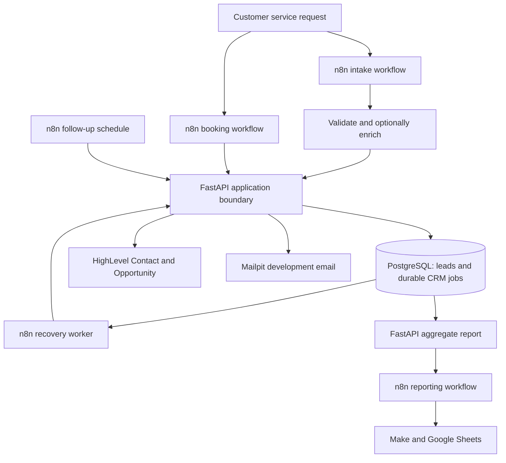

# HVAC lead intake, booking, and CRM recovery

An HVAC enquiry is useful only if the business can act on it. This system accepts a service request, preserves it through an uncertain CRM write, follows up or saves a local appointment, and produces a daily management view. The interesting part is what happens between “the webhook ran” and “the intended customer effect exists”: the application keeps durable work, verifies external identity, and recovers partial failures without blindly creating another record.

**Stack:** JavaScript browser UI and n8n workflows; FastAPI/Python and PostgreSQL for application state; a real HighLevel Contact and Opportunity integration over REST using a Private Integration Token (PIT); optional NVIDIA NIM extraction; development email through Mailpit; and downstream Make.com → Google Sheets reporting. Docker Compose runs the local API, database, CRM contract simulator, and mail sink.



n8n makes the automation path visible and coordinates webhooks, schedules, HTTP calls, and response checks. FastAPI owns business rules, database transactions, and the vendor adapter. PostgreSQL holds application and recovery truth after any individual n8n execution ends. HighLevel holds the external CRM representation; Make is a separate, non-critical reporting destination. The [architecture notes](docs/architecture.md) describe these boundaries in more detail.

## A request enters the system

The browser creates a `submission_id` for the logical enquiry and a `correlation_id` for tracing it. An unchanged retry keeps those IDs and the original form snapshot. The n8n intake workflow validates name, message, contact method, field lengths and types, UUIDs, and received timestamp before calling AI. It trims processing fields, lowercases email, and preserves the customer's original message separately from normalized text. FastAPI validates the prepared contract again.

NVIDIA NIM has one narrow task: extract `service_type`, `location`, `preferred_time`, `urgency`, and `summary` from the service message. Its request asks for JSON, caps output at 180 tokens, and has an 18-second default timeout. The workflow accepts only those five keys, supported service/urgency enums, and bounded, correctly typed text. A malformed or schema-invalid HTTP 200 becomes `fallback_invalid`; a provider error or timeout becomes `fallback_unavailable`. Either fallback sets `needs_review` and lets a valid enquiry continue. AI does not choose contact identity, consent, price, availability, booking truth, technician dispatch, or CRM state. See the [provider diagnostic record](docs/provider-diagnostics.md) for the observed timeout and malformed-success cases.

The decisive handoff is `POST /api/recovery/intake`. FastAPI first commits a unique CRM job containing the prepared canonical payload, its business-data fingerprint, identities, due time, and execution reference. It may then claim and attempt delivery immediately. In live mode, a completed local Lead and verified CRM projection return `201 created` (or `200 replayed`); unfinished durable work returns `202 queued` with a job ID and **no invented CRM lead ID**. n8n checks identity and lifecycle fields before trusting either shape, and the browser validates the returned shape again before showing a saved or queued result. This is the point at which the enquiry is durably accepted, even if the external effect remains pending.


*The customer view shows the accepted request and follow-up state; trace identifiers are available in its technical details.*


*The intake execution shows validation, optional extraction, application persistence, and a checked response as separate steps.*

PostgreSQL retains `leads`, `follow_ups`, `appointments`, `audit_events`, `crm_write_jobs`, `crm_write_attempts`, `recovery_incidents`, and scoped synthetic fault-run state. A Lead and its initial email follow-up are committed together. The recovery job is admitted independently, so a queued request can exist before a Lead is created. Client `received_at` remains source data; server `created_at` is the trusted persistence timestamp. A correlation trace joins later lifecycle and recovery records.

## From local truth to a real HighLevel effect

Saving locally is not the same as proving the remote CRM effect. In `highlevel_live` mode the adapter uses a protected PIT, pins requests to the official HTTPS API host, and maps into **HVAC Service Pipeline → New Lead**. It uses a bounded location Contact list and exact email/phone comparison because HighLevel's exact lookup endpoint requires OAuth; then it checks two custom application fields: Contact submission ID and correlation ID. It searches Opportunities by the dedicated Opportunity submission ID and verifies the Contact, location, and pipeline linkage. A missing Contact is created and read back to verify identity; a missing Opportunity is created with New Lead and its response is checked. Ambiguous matches, a foreign same-email/phone identity, split email/phone matches, malformed success bodies, or exhausted search windows fail closed.

Email or phone can identify a possible Contact, but neither says *which application request* that Contact represents. A shared address, edited phone, or vendor duplicate rule could otherwise make a retry overwrite someone else's record or create a second Opportunity. Stable custom identity fields let the adapter distinguish an existing effect from a foreign one. The [live HighLevel verification](docs/phase-6-live-highlevel-verification.md) records a synthetic website → n8n → FastAPI/PostgreSQL → HighLevel creation and exact replay: one matching Contact, one linked Opportunity, and no new effect on replay.


*The real sub-account Contact carries the two application identities used during reconciliation.*


*The linked Opportunity appears at New Lead and carries the submission identity used to find it again.*

The sub-account also has a configured native **HVAC Lead Acknowledgement** workflow with a New Lead pipeline-stage trigger and personalized email action. A selective reusable Snapshot contains the three identity fields, pipeline, and workflow, without customer records. The acknowledgement remains Draft/unpublished, so it is configuration rather than a claimed production send. This repository implements PIT authentication, not OAuth. The local `contacted` and `appointment_booked` stages do **not** automatically move the HighLevel Opportunity, and a local booking does not reserve a HighLevel calendar slot. A reliable extension would put desired external state in durable outbox work, supersede stale stage versions, retry and reconcile writes, and handle lost acknowledgements.

## The local follow-up and booking lifecycle

An email-capable new Lead gets one pending follow-up; a phone-only Lead does not. A scheduled n8n workflow fetches due items, and FastAPI sends the follow-up through local SMTP before marking it sent and moving the local stage from `new_lead` to `contacted`. The booking workflow accepts a separate `booking_request_id` and an offset-free appointment time in `America/Vancouver` (the Surrey business timezone). FastAPI rejects unsupported or nonexistent local times and stores a timezone-aware instant.

An unchanged booking retry reuses its request ID and returns the same appointment. Reusing that ID with different details, or making a second distinct booking for the same Lead, returns a conflict. Booking locks the Lead and FollowUp rows, creates the appointment, moves the local stage to `appointment_booked`, cancels a still-pending follow-up, and writes audit events in one transaction. Follow-up dispatch takes the same lock order: if booking wins, dispatch sees cancellation; if dispatch wins, booking sees the sent state. The database decides that race, not the timing of two n8n canvases.


*Booking saves local state before the workflow asks FastAPI to send a confirmation.*


*Mailpit lets the developer inspect the accepted and rendered message, including saved service and time details.*

Mailpit is a development SMTP sink. It establishes message generation and local SMTP acceptance, not production delivery or deliverability. The appointment records a requested local time; it reserves neither a technician nor an external calendar. SMTP acceptance and the later database commit of `sent_at` are separate effects, so uncertain email delivery has no universal exactly-once guarantee.

## Why a repeated webhook must not mean a repeated customer effect

Transport may deliver the same request twice. The system treats `submission_id` as the business operation, `correlation_id` as its trace, and a fingerprint of normalized customer data as the conflict check. The first admitted job retains the canonical payload, including the accepted AI result. An equivalent replay returns the existing result; the same submission identity with different business data conflicts. Recovery uses the stored payload instead of calling the model again and allowing a later model answer to change work already admitted. A completed job replays from PostgreSQL without another HighLevel call.

This is **at-least-once retry with reconciled, idempotent business effects**: delivery can repeat, while a confirmed logical request should not create a second logical Contact/Opportunity effect merely because delivery repeated. It is not exactly-once transport. An uncertain remote write is the hard case: a timeout or lost acknowledgement may mean the write committed even though the caller never heard back. Before another create, recovery must determine whether the intended effect already exists.

## Recovery after uncertainty

The recovery worker claims one due job at a time with a bounded database lease. Its token identifies the current owner; an expired worker cannot complete or fail a job after another worker reclaims it. Each actual write has a numbered attempt tied to that exact lease. A shared quota permission can defer a worker without consuming an API attempt. The worker first reconciles the stored identity: a verified complete effect finishes without another create; confirmed absence permits a paced write; an ambiguous or broken lookup never counts as absence.

After an attempted write, verified identity and lifecycle fields complete the job. HTTP 429 respects a parseable `Retry-After` minimum; timeouts, network uncertainty, and server errors receive bounded backoff and enter `retry_wait`. Credential or permission failures enter `blocked` and pause new claims for that shared credential. Business conflicts, invalid contracts, unrepresentable retry timing, or exhausted attempts enter `needs_review`. A protected operator requeue can authorize one further attempt after the cause is corrected; it keeps the old attempt and incident history. Jobs, leases, due times, attempts, and incidents survive n8n and backend restarts. The [recovery runbook](docs/phase-3-runbook.md) gives the exact state and requeue rules.

### A controlled failure that left partial success behind

A scoped synthetic diagnostic prepared **12 durable jobs**, then deliberately bypassed ordinary pacing and recovery. Earlier writes completed, but the local fixed-window CRM fault boundary returned a real HTTP **429** to n8n execution **283**. That execution stayed failed. At that point 10 of 12 synthetic Leads existed and two were missing; the error recorder linked the failed execution to a durable incident. This was controlled fault injection against local test behavior, not a production incident, HighLevel outage, or measurement of HighLevel's vendor rate limit.


*The intentionally direct diagnostic stops at the HTTP rejection after earlier writes have already committed.*

Recovery then used the saved jobs and identities to reconcile each item. It marked effects already present as complete and wrote only confirmed missing effects. The worker was restarted during the exercise; the scoped manifest still reached **12/12 Leads, zero missing submission IDs, and zero duplicate submission IDs**. A retained job shows the 429 attempt associated with execution 283 and later successful recovery in execution 294. The failed canvas was not rewritten into a success. The [execution 283 postmortem](docs/phase-3-failed-run-postmortem.md) and [verification trace](docs/phase-3-verification.md) retain the detailed sequence.


*The attempt history connects the original rejection to a later verified completion without erasing the failed run.*

The lesson is concrete: blindly rerunning a partially successful batch can duplicate business effects. Reconciliation asks what exists remotely before authorizing another create. Separate tests exercise 401/403, 429, 500, timeout, malformed success, stale leases, exact attempt ownership, and a lost acknowledgement that reconciles without a second write. The HighLevel contract simulator provides deterministic HTTP behavior for those cases; its local Contacts and Opportunities are test records, never vendor records.

## An operator can inspect without changing work

`/operations.html` reads the same durable PostgreSQL records through four GET-only endpoints: summary, paged jobs, selected job detail, and paged incidents. An operator can see counts by `pending`, `processing`, `retry_wait`, `completed`, `blocked`, and `needs_review`; filter by state; look up an exact job, submission, or correlation ID; inspect attempts, retry eligibility, linked and unlinked incidents, and local lifecycle context. Observation times make later worker progress visible. An execution reference becomes a link only when both its workflow identity and numeric execution ID justify the installed local n8n editor route.

The page has no claim, retry, or requeue control. Its response models omit `payload_json`, lease and quota tokens, credentials, provider bodies, and arbitrary audit metadata; recorded text is screened, and the browser renders dynamic text safely. Both API and browser constrain clickable execution URLs to the exact local editor origin and path. Protected mutation endpoints remain separate. This is a useful local read surface, not a production authentication or monitoring system. The [Operations verification](docs/phase-4-verification.md) includes redaction and GET-purity checks.

## Reporting is downstream of customer intake

FastAPI computes database aggregates for a Vancouver business date; n8n does not connect to PostgreSQL directly. Its separate, manual reporting workflow fetches the authenticated summary, validates an exact **16-field contract**, and sends only that minimized payload to a protected Make webhook. The contract includes report identity and UTC window, Lead totals and service categories, review count, booked appointments, sent follow-ups, and current open recovery incidents. It excludes customer names, contact details, messages, AI summaries, payloads, credentials, and webhook URLs.

The 16 fields are the version/type and date/window identifiers (`report_version`, `report_type`, `report_key`, `business_date`, `business_timezone`, `window_start_utc`, `window_end_utc`, `generated_at`) plus eight counts (`leads_received`, `furnace_requests`, `air_conditioning_requests`, `other_or_unknown_requests`, `needs_review`, `appointments_booked`, `follow_ups_sent`, `open_recovery_incidents_at_generated_at`). Make's Data Store routes by deterministic `report_key` and adds a new Google Sheets daily row or finds and updates an existing one. A reporting failure cannot undo a committed enquiry or block booking and CRM recovery. The workflow is intentionally inactive/manual; the Make scenario and Sheet configuration are external account state.


*The report key selects the add or existing-row update path after n8n sends aggregate data.*


*The destination is a management aggregate view, not a second customer database.*

Destination inspection mattered. One green Make execution selected the existing row but mapped its columns from the old Search Rows output, so values stayed stale. The mapping was corrected to take the row number from search and all 16 values from the fresh webhook; a later same-key run updated the existing Sheet row. A 2xx Make webhook response means acceptance, not verified Sheet state. The [reporting verification](docs/phase-5-verification.md) records the contract, mapping correction, and isolated failure test.

## Verification and system boundaries

The repository's deterministic checks cover API contracts, PostgreSQL persistence and migrations, concurrent booking/follow-up and recovery claims, stale lease and attempt ownership, retry timing and quota behavior, credential pauses, lost acknowledgements, HighLevel foreign/ambiguous identity handling, malformed upstream success, simulator faults, replay conflicts, reporting and daylight-saving-aware date windows, PII minimization, browser response validation, Operations redaction, and n8n Code-node logic. The full local verifier passed **165 Python tests** with disposable PostgreSQL, **32 browser/helper tests**, **45 n8n workflow tests**, and Ruff. The **58 HighLevel adapter tests** are included in the Python total. GitHub Actions runs those suites on push and pull request; live external services are outside that CI gate.

Separately retained manual/live checks cover n8n executions, NVIDIA responses and fallback, Mailpit messages, the real HighLevel initial Contact/Opportunity projection and replay, and Make/Google Sheets destination inspection. Those services are **not** deterministic CI dependencies. This project uses synthetic demonstration and test customer data; it is not a claim of historical production customer traffic. The controlled 429 is a local test, and the published HighLevel scope is initial CRM projection. External Contact/Opportunity IDs are reconciled from stable fields rather than persisted locally; a local follow-up can become due while projection is still retrying. Later HighLevel stage sync, external calendar/technician reservation, production email sending, OAuth, and exactly-once transport are outside the implemented system.

## Explore and run

Start with the [customer UI](frontend/), [seven n8n exports](n8n/), [API routes](backend/app/api/), [HighLevel adapter](backend/app/providers/highlevel.py), [lifecycle service](backend/app/services/lifecycle_service.py), [recovery service](backend/app/services/recovery_service.py), [Operations projection](backend/app/api/operations.py), and [reporting service](backend/app/services/reporting_service.py). The [models](backend/app/models/), [migrations](backend/migrations/), [contract simulator](backend/simulator/), and [tests](backend/tests/) show where those claims are enforced. For a deeper reconstruction, use the [project handover](docs/project-handover.md), [live HighLevel record](docs/phase-6-live-highlevel-verification.md), and [failure postmortem](docs/phase-3-failed-run-postmortem.md).

For a local checkout, copy [`.env.example`](.env.example) to an ignored `.env`, replace placeholder local secrets, and start the Compose services:

```bash
docker compose up --build -d
```

The website and read-only Operations page are at `http://localhost:18000/` and `/operations.html`; Mailpit is at `http://localhost:18025`; the isolated simulator is at `http://localhost:18080`. n8n runs separately: import the sanitized JSON workflows, configure its protected runtime variables for the adapter and optional NVIDIA/Make calls, then activate the customer and recovery workflows you intend to exercise. The default `development` CRM mode needs no vendor token. `highlevel_simulator` is a local contract/fault mode; `highlevel_live` requires a PIT and the provisioned account mappings described in the [live setup record](docs/phase-6-live-highlevel-verification.md). Keep tokens and Make capability URLs outside tracked files.

Run the deterministic browser and workflow suites with `npm run test:browser` and `npm run test:workflow`. The [full verifier](scripts/verify_phase3.sh) uses a disposable PostgreSQL container for the Python concurrency suite and also checks lint, JSON, shell, Compose, and tracked-secret patterns. It does not send live email, call NVIDIA or HighLevel, run n8n, or invoke Make.
