# HVAC Lead Intake, Booking & Recovery Automation

An end-to-end reference implementation for capturing HVAC enquiries, projecting them to a CRM, managing a local booking/follow-up lifecycle, recovering uncertain CRM writes, and producing management reports.

**This is a technical interview/reference build using synthetic customer data, not a historical production client deployment.** Its initial Contact and Opportunity projection was verified against a real HighLevel sub-account. Faults shown here were injected against a controlled local simulator.

`n8n` · `FastAPI` · `PostgreSQL` · `HighLevel` · `NVIDIA NIM` · `Make` · `Google Sheets` · `Mailpit` · `Docker Compose`

[](https://github.com/kabbersokhi-boop/client-lead-intake-booking-recovery-automation/actions/workflows/ci.yml)

## The customer journey

A customer submits an HVAC service request. n8n validates and normalizes it, optionally extracts service context, and sends a prepared request to FastAPI. FastAPI and PostgreSQL retain the application record and CRM-delivery job before the CRM projection is attempted. The verified live path creates a Contact and Opportunity in HighLevel. The separate local lifecycle supports a demonstration booking or follow-up and sends development email to Mailpit. A downstream reporting flow turns database aggregates into a Google Sheets management view.

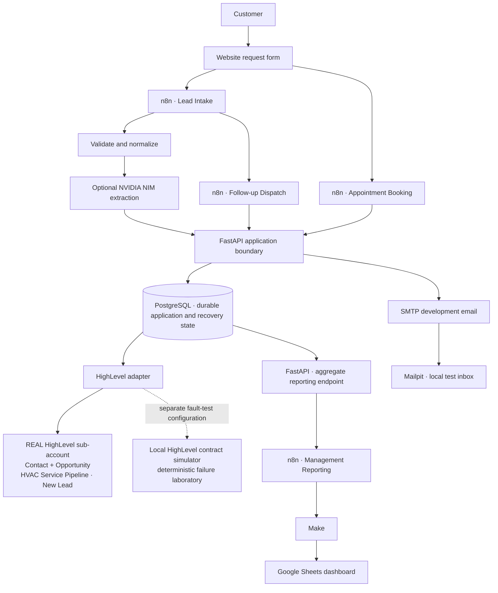

The boundaries are deliberate: **n8n orchestrates; PostgreSQL remembers; FastAPI owns application and recovery operations; the HighLevel adapter owns vendor-specific projection and reconciliation.** The simulator sits outside the live happy path.

## Enquiry to CRM

The website assigns a stable `submission_id` to the business operation and a `correlation_id` to trace that operation across the workflow. n8n rejects invalid requests before the model call, normalizes customer fields, validates any model result, and asks FastAPI to persist the canonical payload. A CRM acknowledgement is accepted only when its identity and lifecycle shape match the request; an unfinished durable write is reported as queued rather than as a fabricated CRM success.

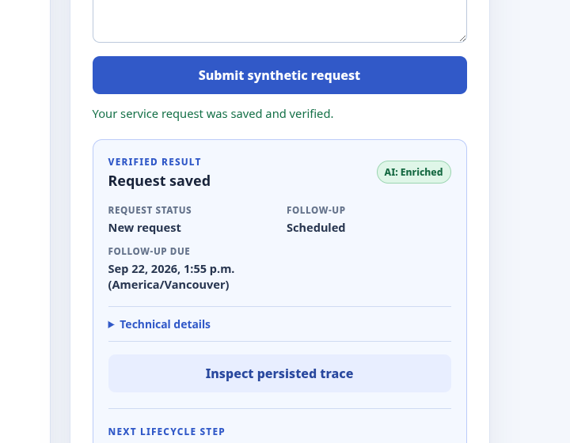

*The form confirms the saved request and follow-up state, with technical trace details available when needed.*

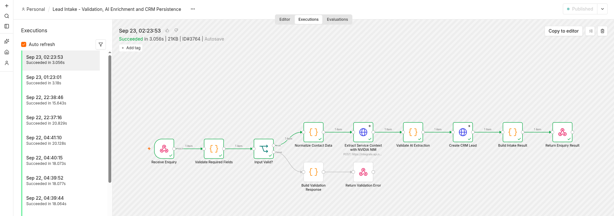

*This successful execution validates the request, extracts bounded service context, checks the extraction, persists through FastAPI, and returns the verified result.*

The live integration was exercised through the website, n8n, FastAPI, PostgreSQL, and the real HighLevel sub-account. The synthetic Jordan Lee Contact shows the integration identity fields and a linked Opportunity activity. The Opportunity is in the vendor UI under **HVAC Service Pipeline → New Lead**, with a synthetic C$0 value.

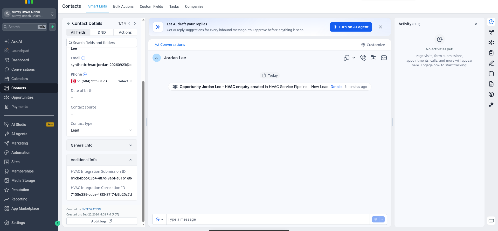

*The live vendor Contact carries the synthetic submission and correlation identity and shows the linked opportunity activity.*

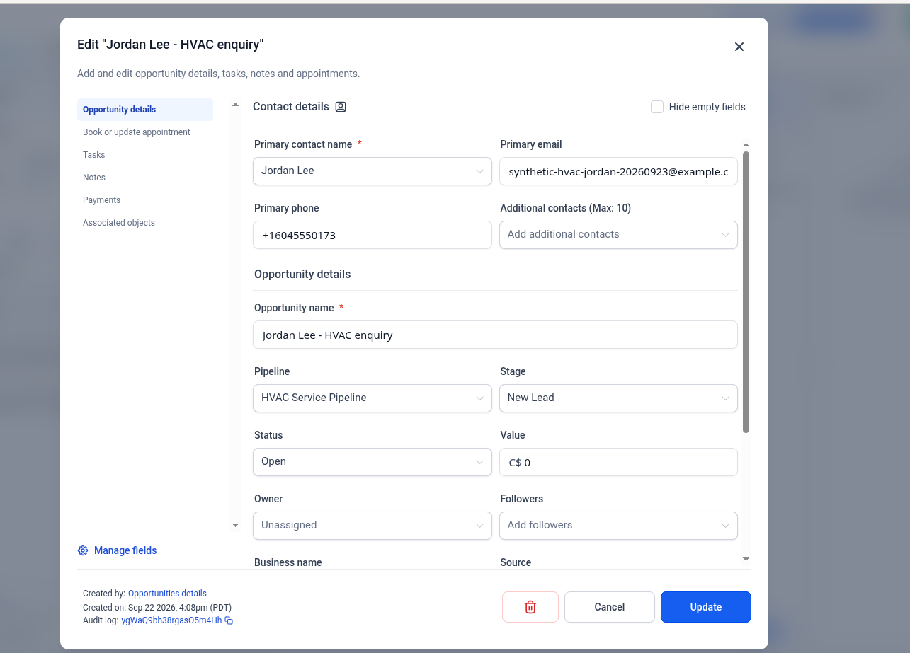

*The real Opportunity is linked to Jordan Lee, assigned to the HVAC pipeline's New Lead stage, and carries a synthetic C$0 value.*

The same website submission was replayed with the same identities and customer fields. The browser received a replay acknowledgement, the durable job remained completed with one attempt, and the HighLevel audit still found one matching Contact and one Opportunity. This is **at-least-once delivery/retry with idempotent business effects and explicit reconciliation**, not a universal exactly-once guarantee.

The live integration path, resource provisioning, exact replay, and clean Compose recreate are recorded in the [HighLevel live verification](docs/phase-6-live-highlevel-verification.md).

## Booking and local email lifecycle

Booking is a separate n8n workflow. It validates the request, persists one local appointment, advances the local lifecycle, and cancels a still-pending follow-up in the same database transaction. If follow-up dispatch wins the transaction race first, booking observes that state; row locks serialize the decision. Confirmation is handed to the FastAPI email boundary and accepted by the local SMTP sink.

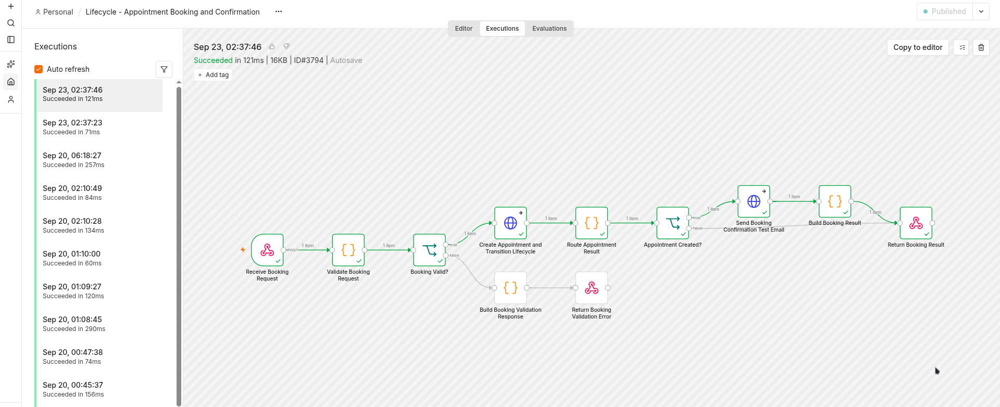

*The successful branch persists the appointment and lifecycle transition before building a verified response.*

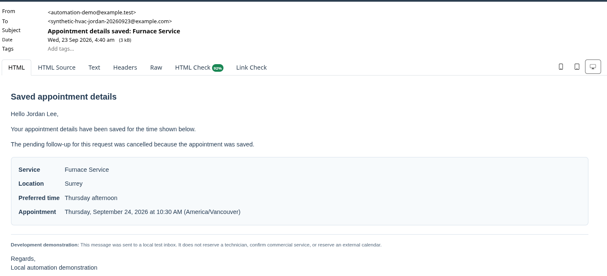

*The rendered development message reflects the saved service, location, preferred time, and local appointment time.*

Mailpit proves the generated personalized message, persisted service/location/time, SMTP acceptance, and rendered HTML. **It is a local development SMTP sink, not a production email provider.** The local appointment records a requested time; it does not reserve technician capacity or an external calendar.

## Reliability: what happens when the CRM write fails?

**“I didn't just connect n8n directly to HighLevel and hope retries were safe. I separated orchestration, durable state, vendor projection, and deterministic fault testing.”**

A CRM write can be created, rate-limited, time out, fail with a server error, or commit remotely while its acknowledgement is lost. A valid HTTP response is not the only proof of the remote effect. The application retains a durable job and attempt history so recovery can check the CRM by stable identity before deciding whether another write is safe.

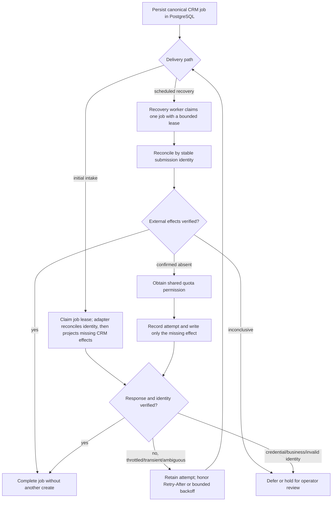

For each write, PostgreSQL keeps the prepared payload, lease ownership, attempt/status history, retry timing, and incident linkage. On initial HighLevel projection, the adapter looks up the stable identity before creating either external record. The recovery workflow independently reconciles before retrying, obtains shared quota permission, and writes only after confirming absence. Successful acknowledgements are checked against the expected identity; inconclusive outcomes are deferred or held rather than treated as absence. Bounded retry exhaustion and credential/business failures remain visible for review. A confirmed completed replay is served from the stored result without reopening upstream risk.

### The controlled HTTP 429 test

Execution **283** is a deliberately orchestrated fault-injection test with synthetic data and the controlled local CRM simulator. It is not a production outage, a HighLevel outage, or a client incident.

The test prepared 12 durable CRM jobs, then used a diagnostic path that deliberately bypassed normal pacing and recovery. The simulator returned a real HTTP 429 after earlier writes had committed. n8n execution 283 failed; the successful writes were retained and two records remained missing on that path. Recovery then reconciled the same durable jobs, skipped records already present, and completed only missing work. The final manifest was **12/12 with zero duplicate submission IDs**. The detailed trace for one job shows the failed 429 attempt in execution 283 followed by a successful recovery attempt in execution 294.

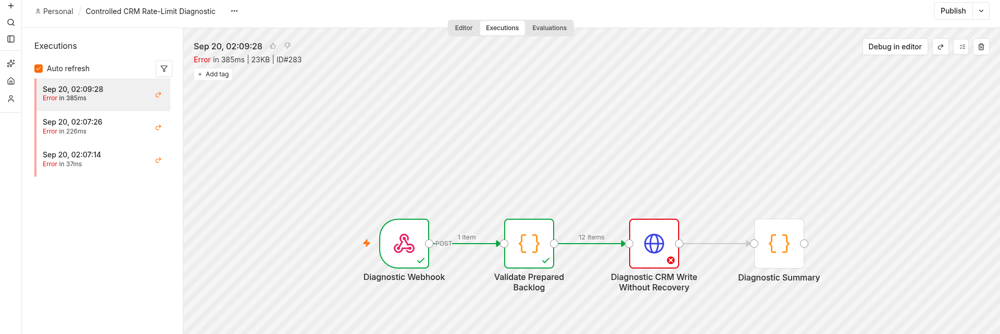

*The intentionally unsafe diagnostic sends a synthetic batch directly to the controlled CRM boundary; the actual HTTP 429 fails execution 283 after partial success.*

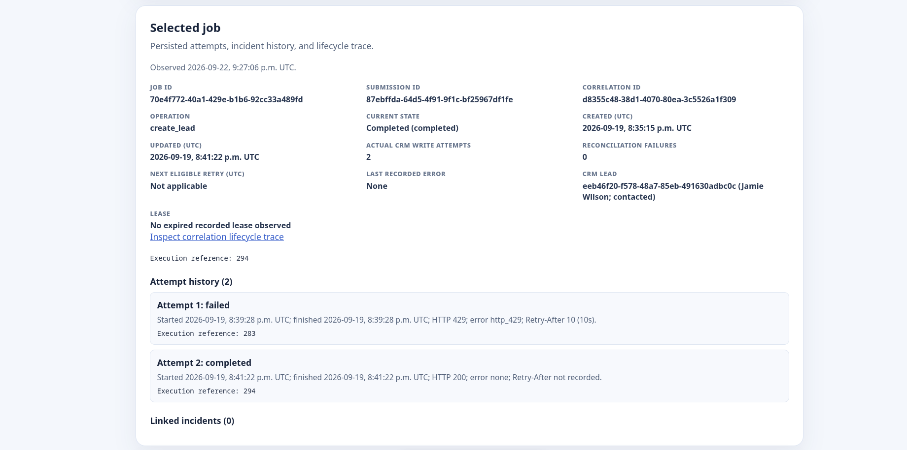

*The persisted job history keeps both attempts: HTTP 429 in execution 283, then verified completion in execution 294.*

Reliability claims should be tested, not merely asserted. This test demonstrates at-least-once delivery and recovery with idempotent business effects and explicit reconciliation. It does not establish exactly-once transport semantics or a real HighLevel rate limit.

The full retained evidence chain, including the error recorder and later batch reconciliation, is in the [Phase 3 verification](docs/phase-3-verification.md) and [execution 283 postmortem](docs/phase-3-failed-run-postmortem.md).

`submission_id` identifies the logical business operation that should be applied once. `correlation_id` follows that operation through intake, persistence, attempts, incidents, and trace views. They answer different questions: “Which request is this?” and “Where did it travel?”

## Real HighLevel integration

The live sub-account has the **HVAC Service Pipeline** with **New Lead**, **Contacted**, and **Appointment Booked** stages, plus three identity custom fields: Contact submission ID, Contact correlation ID, and Opportunity submission ID. The adapter uses a protected Private Integration Token for server-to-server requests, pins the API host, and reconciles the expected Contact/Opportunity identity before retrying unfinished work. No token or vendor resource ID is included here.

The local interview runtime currently persists `highlevel_live` in ignored, protected `.env` configuration. A clean Compose recreate verified that mode and its resource mappings persisted. The tracked `.env.example` remains safe and defaults to `development`. PostgreSQL remains application and reliability truth; HighLevel is the external CRM projection.

The sub-account also contains a native **HVAC Lead Acknowledgement** workflow. Its trigger is **Pipeline stage changed → HVAC Service Pipeline → New Lead** and it has a **Send Acknowledgement Email** action personalized with `{{contact.first_name}}`. It remains **Draft/unpublished** because this demo sub-account is not configured as a production sender. The screenshot below is configuration evidence only; the booking email shown above is a separate Mailpit demonstration.

<details>
<summary>Supporting HighLevel configuration screenshots</summary>

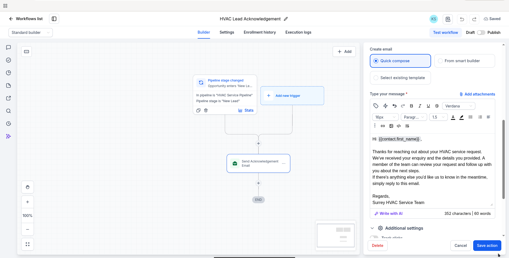

*The native workflow contains the New Lead pipeline-stage trigger and personalized acknowledgement action. It is deliberately unpublished.*

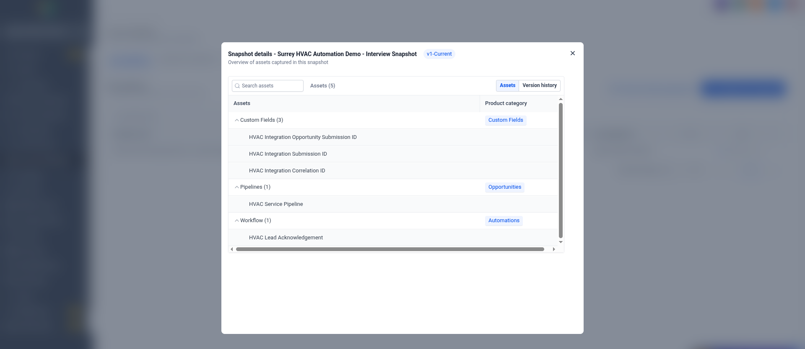

*The reusable Snapshot contains three integration identity custom fields, the HVAC Service Pipeline, and the acknowledgement workflow. It does not contain Contacts, Opportunities, or their history.*

</details>

**Known lifecycle boundary:** initial Contact and Opportunity projection to HighLevel is live and verified. Later local `contacted` or `appointment_booked` state does not automatically move the existing HighLevel Opportunity stage. A sound implementation needs its own durable desired-state/outbox process with retries, reconciliation, supersession/versioning, and lost-ack handling. The local appointment also does not synchronize to a HighLevel calendar.

## Management reporting

Reporting is deliberately downstream of customer intake:

```text
PostgreSQL → FastAPI aggregate endpoint → n8n Management Reporting
           → Make Custom Webhook → Make Data Store routing
           → Google Sheets Daily Reports → HVAC Management Dashboard
```

n8n does not query PostgreSQL directly. FastAPI performs the aggregates and returns a sanitized 16-field contract. The report contains counts and service categories, not lead names: management needs business totals, while individual customer records belong in HighLevel or application views. This also limits duplicate CRM data and minimizes PII in Sheets.

The demonstrated Make scenario adds a row for the first business date. For a report key already in the Data Store, it searches for and updates the existing Sheets row with fresh webhook values. Live destination inspection confirmed one row and a corrected same-key refresh; a prior green Make execution had written stale values, which manual inspection caught. This is demonstrated upsert-like behavior, not a universal exactly-once guarantee.

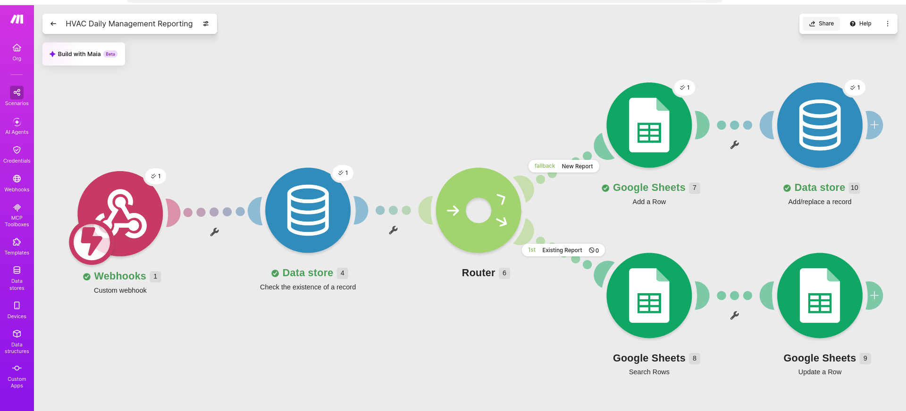

*Make checks the report key, then adds a daily row or finds and updates the existing row.*

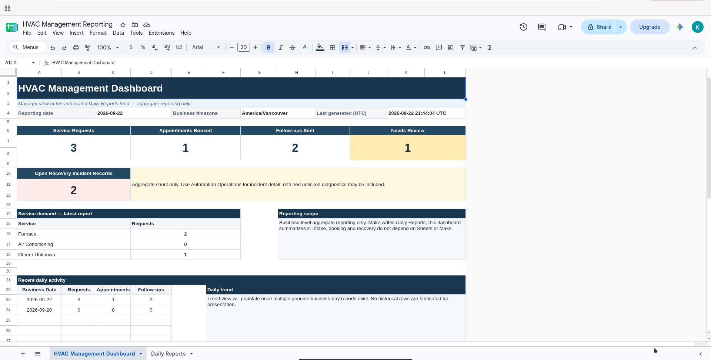

*The manager-facing view contains daily aggregates and service categories rather than individual lead records.*

Make and Sheets are non-critical: a reporting failure can lose that report, but cannot undo a durably stored customer enquiry.

The 16-field contract, the corrected same-key Sheet update, and the isolated reporting failure are described in the [Phase 5 verification](docs/phase-5-verification.md).

## AI is a bounded helper

NVIDIA NIM optionally extracts five fields from the original enquiry: service type, location, preferred time, urgency, and a short summary. Application validation checks the exact response shape and allowed values. **An HTTP 200 from an AI provider is not considered success unless the returned payload passes application validation.** Timeout, malformed output, or unusable values use a safe fallback and do not discard a valid enquiry.

The model does not decide contact identity, consent, price, availability, bookings, or CRM state. The source message remains distinct from normalized processing text, and recovery reuses the stored canonical payload instead of rerunning enrichment.

## Workflow inventory

| Area | Workflow | Responsibility |
| --- | --- | --- |
| Customer journey | `Lead Intake - Validation, AI Enrichment and CRM Persistence` | Validate, enrich, persist, and return a truthful intake result |
| Customer journey | `Lifecycle - Appointment Booking and Confirmation` | Persist a local booking, transition lifecycle, hand off confirmation |
| Customer journey | `Lifecycle - Dispatch Due Follow-ups` | Dispatch due follow-ups and record local lifecycle state |
| Reliability | `CRM Lead Write Recovery Dispatch` | Claim, reconcile, pace, retry, or complete durable CRM jobs |
| Reliability | `CRM Recovery Failure Recorder` | Record workflow incidents with safe correlation evidence |
| Reliability | `Controlled CRM Rate-Limit Diagnostic` | Inactive diagnostic used only for controlled local fault injection |
| Reporting | `Management Reporting - HVAC Snapshot` | Fetch and validate aggregates, then send them to Make; manual/inactive |

## Engineering responsibilities

| Technology | Role in this system |
| --- | --- |
| n8n | Visible intake, booking, scheduled follow-up and recovery orchestration |
| FastAPI / Python | Validation boundary, application services, lifecycle and recovery APIs, reporting contract, provider boundary |
| PostgreSQL | Durable leads, appointments, follow-ups, audit events, CRM jobs, attempts, incidents, leases and fault-test state |
| HighLevel | Real external Contact and Opportunity projection |
| HighLevel contract simulator | Separate deterministic local failure laboratory; never the live happy path |
| NVIDIA NIM | Optional, schema-validated service-context extraction |
| Make + Google Sheets | Non-critical aggregate management reporting |
| Mailpit | Local development SMTP sink and rendered-message inspection |
| Docker Compose | Repeatable local backend, database, simulator, and Mailpit services |

The recovery boundary also covers stable replay, canonical stored payloads, bounded attempts, leases, stale-lease rejection, `Retry-After`, shared quota permission, credential-wide claim pauses, operator requeue, and restart durability. The simulator supplies controlled 401, 429, 500, timeout, and uncertain-write conditions. Those conditions test application behavior; they do not claim to reproduce a vendor's global quota policy.

## Verification and limits

The deterministic CI suite runs **165 Python tests**, **32 browser/helper tests across three suites**, and **45 n8n workflow tests**. The focused HighLevel adapter subset contains **58 tests; all are included in and passed as part of the 165 Python tests**, not additive. CI also runs Ruff. The retained exact-SHA run for checkpoint `b1095f08d8cd34708def90f0878024663b17b9fa` passed as [Backend CI run 35795367301](https://github.com/kabbersokhi-boop/client-lead-intake-booking-recovery-automation/actions/runs/35795367301). Live HighLevel, NVIDIA, Make/Sheets, n8n, and Mailpit checks are separately documented; they are not represented as deterministic CI tests.

Current boundaries:

- Synthetic reference/interview data; not historical production customer traffic.
- Real HighLevel evidence covers initial Contact and Opportunity projection and exact replay. Automatic later lifecycle-stage sync is not implemented.
- Local appointment state does not reserve a technician or external calendar slot.
- Mailpit is not production email, and SMTP acceptance cannot be made atomic with the later database commit.
- Simulator faults are controlled tests, not real vendor outages or vendor-rate-limit evidence.
- Reporting contains aggregates and is downstream/non-critical; the Make scenario and Sheet mappings are external account configuration.
- Delivery is at least once with idempotent business effects and reconciliation; there is no universal exactly-once claim.

## Explore the implementation

| Area | Code and evidence |
| --- | --- |
| Customer website | [`frontend/`](frontend/) |
| n8n exports and workflow tests | [`n8n/`](n8n/) |
| FastAPI routes and schemas | [`backend/app/api/`](backend/app/api/), [`backend/app/schemas/`](backend/app/schemas/) |
| Persistence models and migrations | [`backend/app/models/`](backend/app/models/), [`backend/migrations/`](backend/migrations/) |
| Lifecycle and reporting services | [`backend/app/services/lifecycle_service.py`](backend/app/services/lifecycle_service.py), [`backend/app/services/reporting_service.py`](backend/app/services/reporting_service.py) |
| Durable recovery service | [`backend/app/services/recovery_service.py`](backend/app/services/recovery_service.py) |
| HighLevel provider/client | [`backend/app/providers/highlevel.py`](backend/app/providers/highlevel.py) |
| Controlled HighLevel simulator | [`backend/simulator/`](backend/simulator/) |
| Backend and adapter tests | [`backend/tests/`](backend/tests/) |
| Browser and workflow tests | [`frontend/test/`](frontend/test/), [`n8n/tests/`](n8n/tests/) |
| Retained verification record | [`docs/`](docs/) |

## Run locally

For a fresh checkout, copy the safe root [`.env.example`](.env.example) to `.env`, set unique local database and adapter credentials, then run:

```bash
docker compose up --build
```

The website is served at `http://localhost:18000`; Mailpit is at `http://localhost:18025`, and the isolated simulator UI is at `http://localhost:18080`. Import the sanitized n8n exports and configure any external-provider secrets only in protected runtime storage. This workstation's ignored `.env` is already configured for `highlevel_live`; never replace or publish that protected configuration. See the [`interview demo runbook`](docs/interview-demo-runbook.md) for the browser walkthrough.
