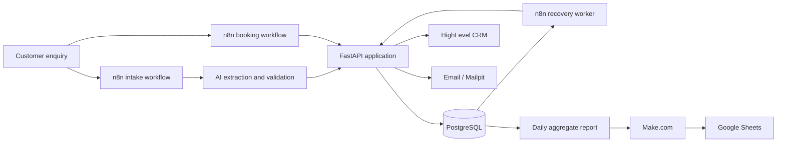

# Reliable AI Lead Intake, Booking, and CRM Recovery

An end-to-end automation system for service businesses that captures customer enquiries, enriches them with AI, creates and updates CRM records, manages follow-up and booking, and recovers safely when external services fail.

The project focuses on a problem that simple webhook automations usually ignore: an HTTP request can time out even after the remote system has saved the record. Retrying blindly can create duplicate contacts, opportunities, appointments, or messages. This system persists every intended operation, assigns stable identities, checks the remote result, and retries only when it is safe.

## What this project demonstrates

- **AI-assisted intake:** extracts service type, location, preferred time, urgency, and a short summary from free-form enquiries.
- **Durable workflow execution:** accepts valid leads into PostgreSQL before relying on an external CRM call.
- **Safe CRM recovery:** handles rate limits, server errors, timeouts, malformed responses, and lost acknowledgements.
- **Idempotency:** repeated submissions and booking requests reuse the original business operation instead of creating duplicates.
- **Auditable operations:** stores request identities, attempts, incidents, retry timing, and lifecycle history for inspection.
- **Customer lifecycle automation:** supports follow-up, local appointment booking, confirmation email, CRM stage updates, and daily reporting.
- **Honest AI boundaries:** invalid or unavailable AI results are marked for review while the original lead continues through the system.

## System architecture


```mermaid
flowchart LR
    Customer[Customer enquiry] --> N8N[n8n intake workflow]
    N8N --> AI[AI extraction and validation]
    AI --> API[FastAPI application]
    API --> DB[(PostgreSQL)]
    API --> CRM[HighLevel CRM]
    DB --> Recovery[n8n recovery worker]
    Recovery --> API
    Customer --> Booking[n8n booking workflow]
    Booking --> API
    API --> Mail[Email / Mailpit]
    DB --> Report[Daily aggregate report]
    Report --> Make[Make.com]
    Make --> Sheets[Google Sheets]
```

**Responsibility split:** n8n coordinates webhooks, schedules, and external calls. FastAPI owns validation, transactions, lifecycle rules, and provider adapters. PostgreSQL remains the source of truth for work that must survive workflow or service restarts.

## A complete lead journey

1. The browser creates a stable submission ID and correlation ID.
2. n8n validates and normalizes the enquiry.
3. NVIDIA NIM optionally extracts structured service information.
4. FastAPI stores a durable CRM job and its business-data fingerprint.
5. The HighLevel adapter finds or creates the matching Contact and Opportunity.
6. A repeated request is reconciled against the stored and remote identities.
7. Follow-up and booking update local state and the desired CRM stage.
8. Recovery workers retry incomplete work using persisted schedules and attempt history.
9. Aggregate daily results can be sent through Make to Google Sheets.


*The customer receives a verified result only after the application accepts the request. Technical trace details remain available for investigation.*


*The intake workflow separates input validation, AI extraction, schema validation, durable persistence, and response verification.*

## GoHighLevel CRM integration

In `highlevel_live` mode, the provider adapter uses the official HighLevel REST API to create or reconcile a Contact and its linked Opportunity in the configured service pipeline. Application-owned submission and correlation fields bind the remote records to the original request. The adapter reads the records back and verifies their identity, location, pipeline, stage, and Contact relationship before treating the operation as complete.


*A synthetic Contact created by the integration carries the stable submission and correlation identities used during replay and recovery.*


*The linked Opportunity is placed in the HVAC Service Pipeline at New Lead. Later follow-up and booking events advance its desired stage through a separate reconciliation worker.*

## Recovery is part of the design

Each logical enquiry has a stable identity and normalized fingerprint. Before repeating a CRM write, the application checks whether the intended Contact or Opportunity already exists. This matters when a remote write succeeds but its response is lost.

The recovery layer includes:

- durable jobs and numbered attempts;
- bounded database leases for worker ownership;
- exponential retry scheduling and `Retry-After` support;
- reconciliation before another remote create;
- credential-wide pauses for authentication failures;
- terminal `needs_review` states for ambiguity or exhausted retries;
- operator-visible incident and attempt history;
- monotonic CRM stage progression, so later lifecycle states are not overwritten by older work.

The repository includes deterministic scenarios for normal intake, duplicate delivery, unavailable AI, CRM rate limiting, and a lost acknowledgement after the CRM has already committed the write.


*A retained job records the initial HTTP 429 and a later verified completion. The failed attempt remains visible instead of being rewritten as a success.*

## AI extraction and evaluation

AI enrichment is advisory. It does not decide customer identity, consent, pricing, technician availability, booking confirmation, or CRM truth. A timeout, provider error, or invalid schema sets `needs_review`; it does not discard an otherwise valid enquiry.

The repository contains a frozen 60-case synthetic evaluation set, a versioned rubric, schema checks, durable request accounting, a request cap, and development/held-out result separation.

During evaluation, the original `openai/gpt-oss-20b` endpoint repeatedly timed out. A separately versioned NVIDIA Nemotron Lightning profile completed all 60 cases:

| Result | Development | Held out | Total |
|---|---:|---:|---:|
| Attempts | 40 | 20 | 60 |
| Schema-valid responses | 37 | 19 | 56 |
| Invalid responses | 2 | 0 | 2 |
| Timeouts | 1 | 1 | 2 |
| All scored fields matched | 9 | 6 | 15 |

The strict score exposes real classification disagreements and conservative exact-match grading. It is evidence from synthetic cases, not a claim of production accuracy. Summaries still require human review. See the [provider recovery report](docs/reviews/provider-recovery.md) and [full evaluation results](docs/reviews/milestone-2a-results-lightning.md).

The evaluated Lightning configuration is available as an opt-in workflow export generator. It has not been silently applied to the canonical workflow or a live deployment.

## Guided local demo

The isolated demo requires Docker with Compose, `curl`, and `openssl`. It uses synthetic records, a local HighLevel contract simulator, Mailpit, and a deterministic AI boundary, so no external credentials are required.

```bash
git clone https://github.com/kabbersokhi-boop/client-lead-intake-booking-recovery-automation.git
cd client-lead-intake-booking-recovery-automation
./scripts/demo up
```

Open **http://localhost:28000/demo.html** and run any of the five scenarios. Each scenario verifies the result against database and simulator evidence.

```bash
./scripts/demo down     # stop the isolated demo and retain its volumes
./scripts/demo reset    # remove only the isolated demo resources
```

The [written demo guide](docs/guided-demo.md) explains the scenarios, expected evidence, reset behavior, and troubleshooting.

<!-- Add the recorded end-to-end video here after it is uploaded. -->

## Business reporting

FastAPI produces a minimized 16-field daily aggregate without customer names, contact details, messages, or AI summaries. n8n sends it to Make, which creates or updates the matching Google Sheets row using a deterministic report key. Reporting failures cannot undo intake, booking, or CRM recovery.


*The Make scenario checks the deterministic report key, creates a new daily row when needed, or updates the existing row without duplicating the report.*


*The management view summarizes service demand, appointments, follow-ups, review volume, and open recovery incidents.*

## Technology

| Layer | Technology |
|---|---|
| Workflow automation | n8n |
| Application API | FastAPI, Python |
| Durable state | PostgreSQL |
| Customer interface | JavaScript, HTML, CSS |
| AI provider | NVIDIA NIM |
| CRM | HighLevel REST API and local contract simulator |
| Email development | Mailpit |
| Reporting | Make.com and Google Sheets |
| Local environment | Docker Compose |
| Verification | Pytest, Node test runner, Playwright, Ruff |

## Verification evidence

The current verified baseline includes:

- **197** Python/PostgreSQL tests;
- **33** browser and helper tests;
- **48** workflow tests;
- **33** AI evaluation tests;
- lint, JavaScript syntax, JSON, shell, Docker Compose, diff, and tracked-secret checks;
- real Chrome coverage for the five guided demo scenarios from Milestone 1;
- retained evidence from synthetic HighLevel, NVIDIA, Mailpit, Make, and Google Sheets exercises.

The test suites cover validation, database transactions, concurrent workers, lease expiry, retry timing, rate limits, replay conflicts, ambiguous CRM identity, lost acknowledgements, booking conflicts, stage synchronization, reporting minimization, and browser response validation.

```bash
npm ci
npm run test:browser
npm run test:workflow
npm run test:evaluation
./scripts/verify_phase3.sh
```

## Repository map

```text
backend/app/                 FastAPI routes, services, models, and providers
backend/migrations/          PostgreSQL schema migrations
backend/simulator/           Local HighLevel contract and fault simulator
backend/tests/               Application and concurrency tests
frontend/                    Customer and operations interfaces
frontend/e2e/                Browser-driven demo verification
n8n/                         Sanitized workflow exports
n8n/evaluation/              Frozen AI datasets, rubrics, and evaluator tests
scripts/                     Demo, verification, diagnostics, and evaluation tools
docs/                        Architecture, runbooks, reports, and retained evidence
```

Start with the [architecture notes](docs/architecture.md), [guided demo](docs/guided-demo.md), [recovery runbook](docs/phase-3-runbook.md), and [project handover](handover.md).

## Scope and limitations

- The guided demo uses synthetic data and simulated external faults.
- Mailpit proves local message generation and SMTP acceptance, not production delivery.
- Local appointments do not reserve a technician or an external calendar slot.
- HighLevel integration uses a Private Integration Token; OAuth is outside the current scope.
- Make and Google Sheets are downstream reporting destinations and are not required for lead acceptance.
- AI evaluation uses synthetic, AI-assisted labels and does not establish production accuracy or ROI.
- The alternative Lightning profile still requires an isolated end-to-end acceptance run before activation in a deployed workflow.

## Engineering intent

This repository demonstrates how to build automation around unreliable networks and external APIs without hiding uncertainty. The design records what was intended, what was attempted, what was observed, and what still needs human review. That makes failures inspectable and recovery repeatable while preserving the original customer operation.
