# From enquiry to appointment: the recorded demo

**One synthetic customer. Real workflow executions. Verified CRM and reporting updates.**

[Watch / download the complete 2:27 demo](https://github.com/kabbersokhi-boop/client-lead-intake-booking-recovery-automation/raw/refs/heads/main/docs/assets/video/HVAC-End-to-End-Demo.mp4) · [Repository overview](../README.md) · [Try the isolated local demo](guided-demo.md)

The 1920 × 1080 recording follows a furnace-service enquiry from the browser through n8n, PostgreSQL, live GoHighLevel, local booking and development email, then a separate daily-reporting workflow through Make and Google Sheets.

## Quick walkthrough

1. **0:05 — Enter the lead.** Type a synthetic furnace-service request and submit the actual customer form.
2. **0:24 — Verify intake.** Inspect the successful n8n execution and persisted acceptance.
3. **0:38 — Verify live CRM creation.** Open the synthetic Contact and its linked Opportunity creation audit.
4. **0:49 — Complete the local booking journey.** Save an appointment, inspect successful n8n execution, confirm the live Opportunity reaches Appointment Booked, and inspect Mailpit and the completed durable job.
5. **1:24 — Create the daily report.** Run n8n reporting, show Make's successful New Report branch, and inspect the row written to Google Sheets.
6. **1:55 — Refresh without duplicating.** Run reporting again, show Make's successful Existing Report branch, and verify the same row has a fresh timestamp before opening the dashboard.

The MP4 contains chapter markers for the individual screens. Timing is rounded down to the nearest second.

## Screenshot tour

The recorded-journey screenshots below are frames extracted directly from the final edited video, at full 1920 × 1080 resolution. The native GHL workflow and recovery screenshots are separately labelled retained evidence, not video frames. Click an image to inspect the details. The chapter headers distinguish local application views from live external services.

### 1. Customer enquiry and verified intake

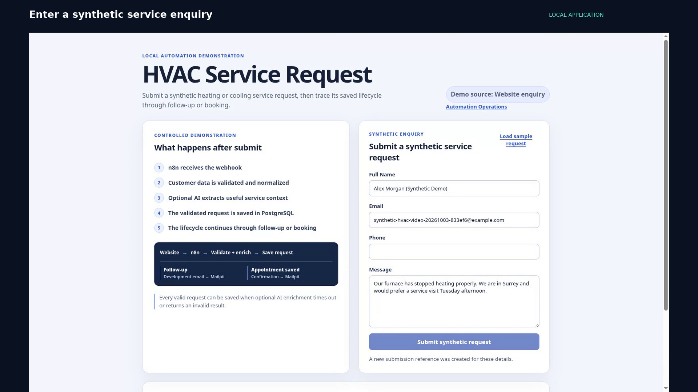

The form assigns stable request identities. A valid enquiry is retained even when optional AI enrichment is unavailable; the UI verifies the application response instead of treating every HTTP response as a successful CRM write.

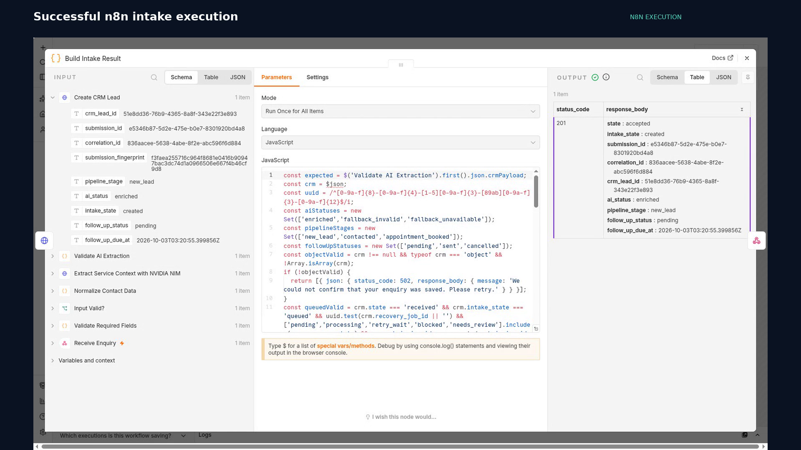

The recorded intake execution is **63187**, status **success**. This run returned HTTP 201 (`created`) with enriched AI state. Optional AI availability remains separate from durable acceptance.

### 2. Live CRM and booking

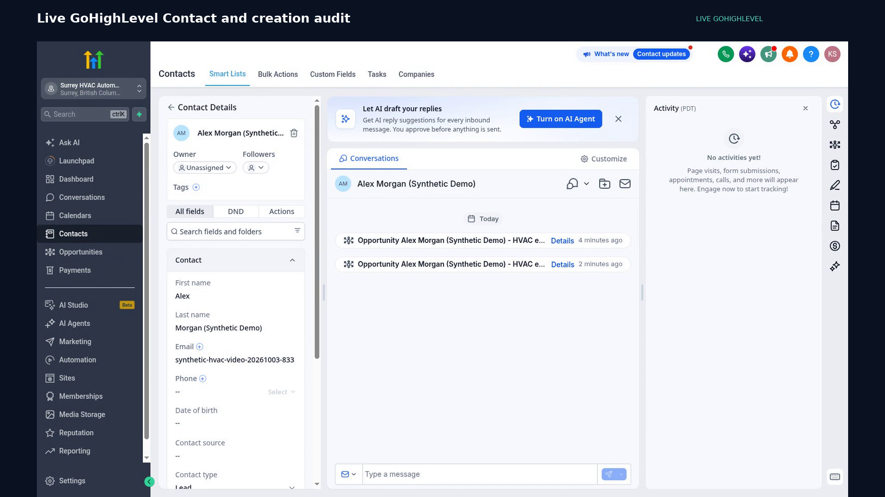

The live CRM displays **Alex Morgan (Synthetic Demo)**, with Contact and Opportunity creation in the audit. The adapter binds records to application identities and reads them back before considering the write verified.

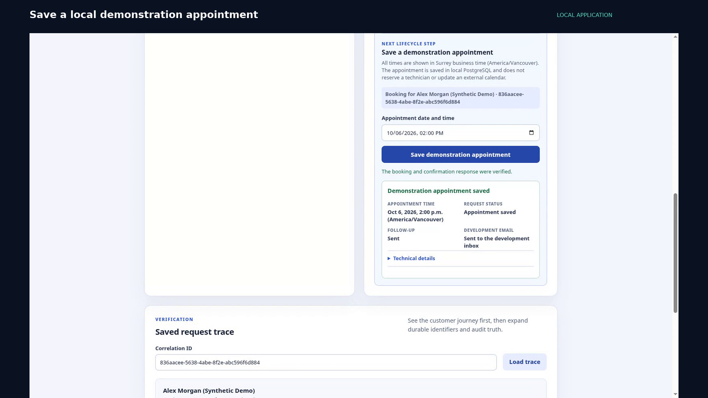

The appointment is saved in **local PostgreSQL**. It is not an external calendar reservation or a technician-capacity check.

<details>
<summary>Inspect the successful appointment workflow and live CRM stage</summary>

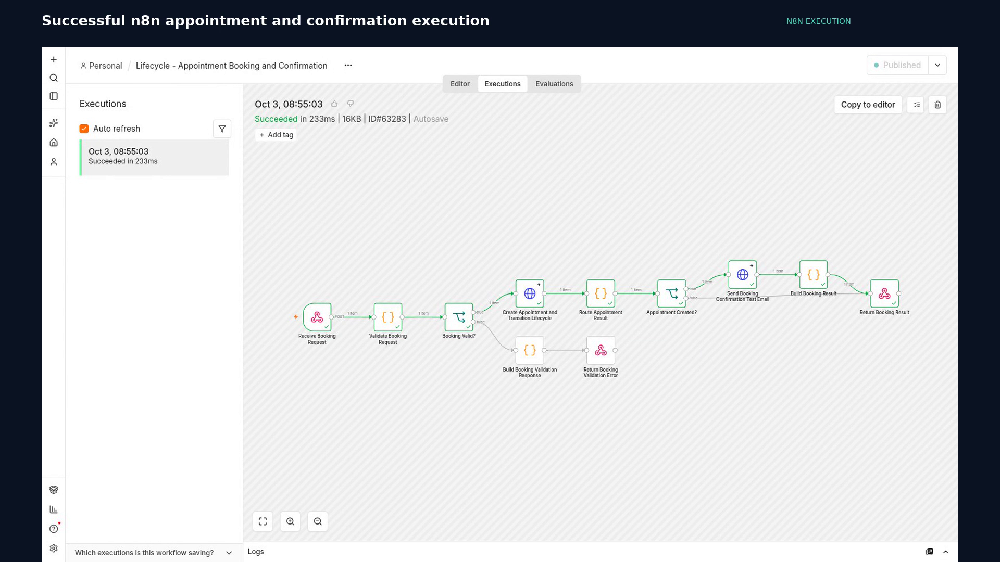

Booking execution **63283** succeeded. A separate stage-reconciliation path advances and verifies the live Opportunity.

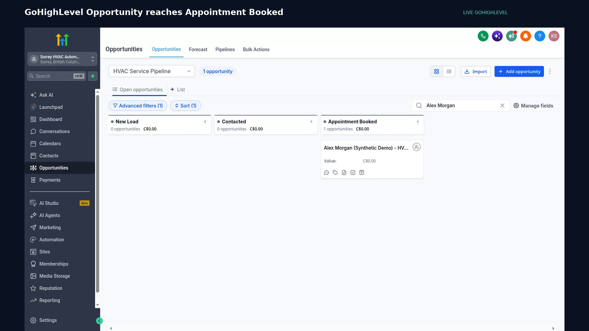

The live pipeline shows the matching Opportunity at **Appointment Booked**. Stage progression is monotonic: older lifecycle work cannot overwrite a later desired stage.

</details>

### Native GoHighLevel automation — configured in Draft

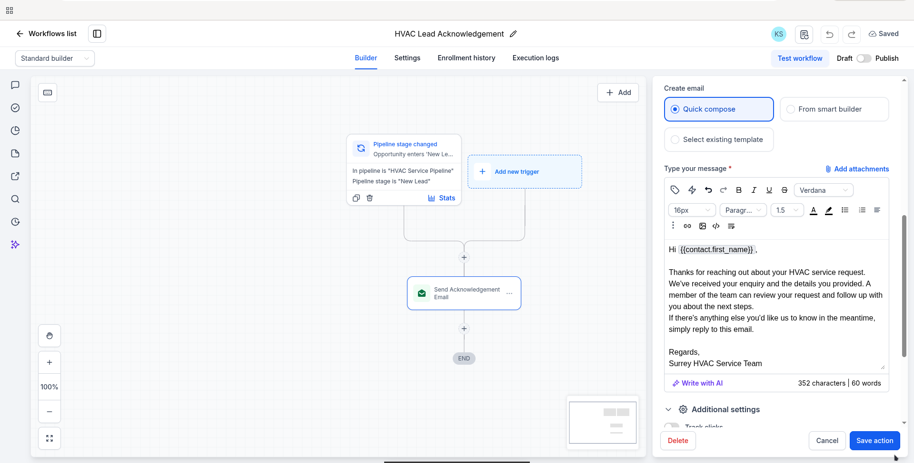

**Opportunity enters New Lead → acknowledgement email.** The native builder shows the HVAC Service Pipeline / New Lead trigger and a personalized acknowledgement using `{{contact.first_name}}`. This complements the API integration by demonstrating configuration inside GoHighLevel itself.

The workflow remains **Draft**. This is retained configuration evidence—not proof of execution, enrolment, or production email delivery—and it was not activated during the recorded demo. The n8n/Mailpit appointment confirmation below is a separate path.

### 3. Confirmation and operational trace

<details>
<summary>Inspect development email and the completed durable job</summary>

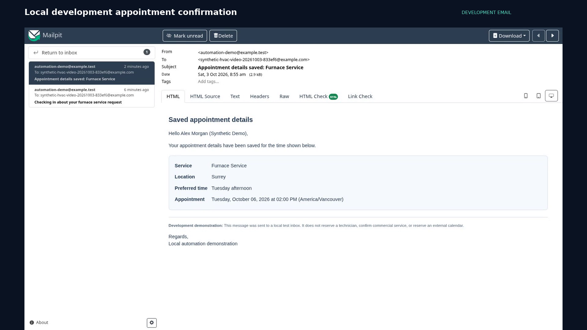

Mailpit proves message generation and **development SMTP acceptance**, not delivery to a real customer's inbox. The address uses the reserved `example.com` domain.

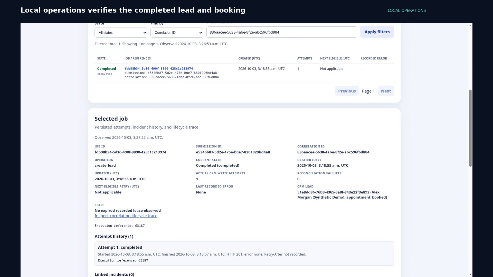

The operations view is filtered to the recorded customer. The CRM job completed in one attempt, with zero linked incidents; the appointment and stage synchronization were read back and verified separately.

</details>

### 4. Make and Google Sheets: create, then update

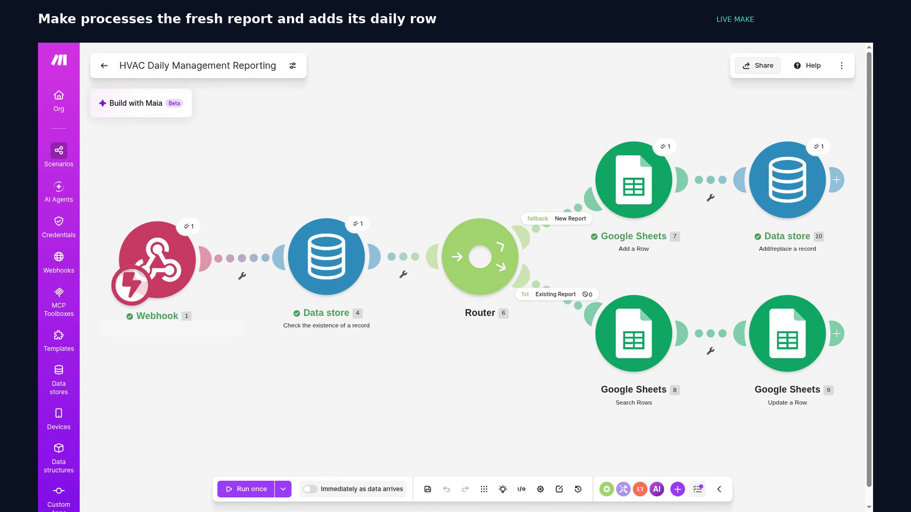

The first reporting run reaches **New Report → Add a Row → Add/replace a record**. This is a live Make execution, not an illustrative workflow drawing.

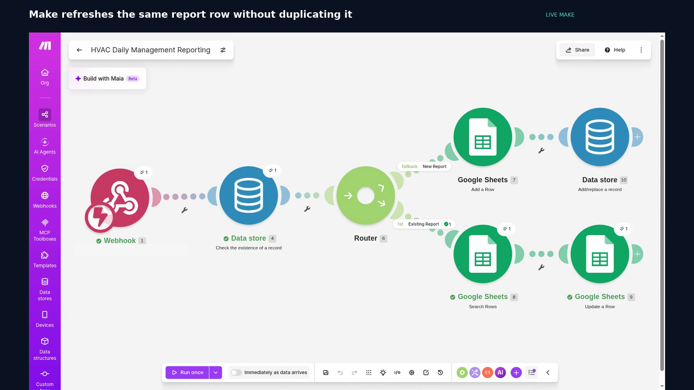

The second run reaches **Existing Report → Search Rows → Update a Row**. The same deterministic key, `hvac-daily:2026-10-02`, is reused rather than creating another daily report.

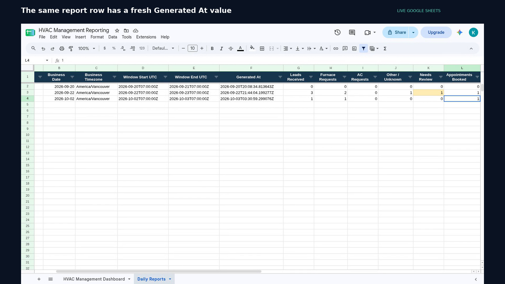

Readback of **Daily Reports** confirmed row 4 remained the report row and rows 5–6 stayed blank. Its `Generated At` changed from `2026-10-03T03:28:56.095350Z` to `2026-10-03T03:30:59.299076Z`. The report date is **October 2 in America/Vancouver**; the generation timestamps are October 3 in UTC.

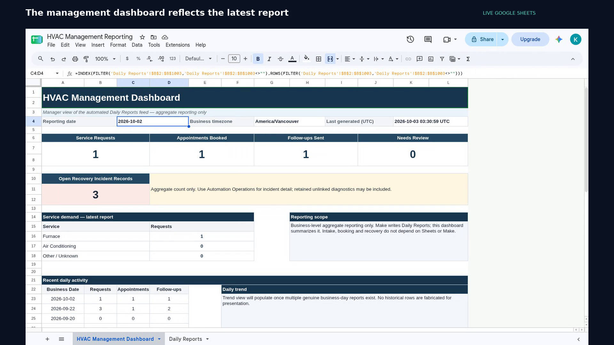

The report contains **1 request · 1 furnace enquiry · 1 appointment · 1 follow-up · 0 duplicate report rows**. Reporting is a minimized business aggregate, not a spreadsheet of customer details. The dashboard's three open incident records include retained historical diagnostics; the recorded customer's completed job has zero linked incidents.

## Retry and error recovery are retained

Recovery was intentionally omitted from this video's footage. It remains a first-class part of the repository and is documented with separate, original evidence.

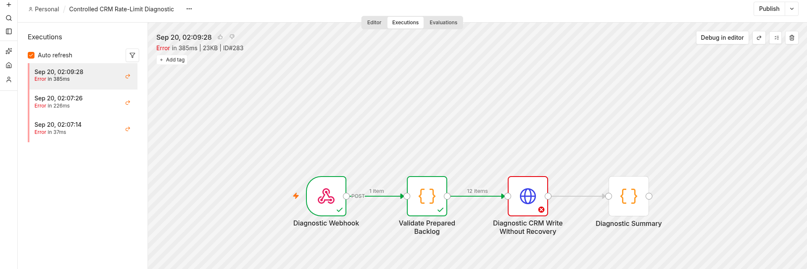

The intentionally unsafe diagnostic hits a controlled **local** rate limit. This screenshot is not presented as a live HighLevel outage.

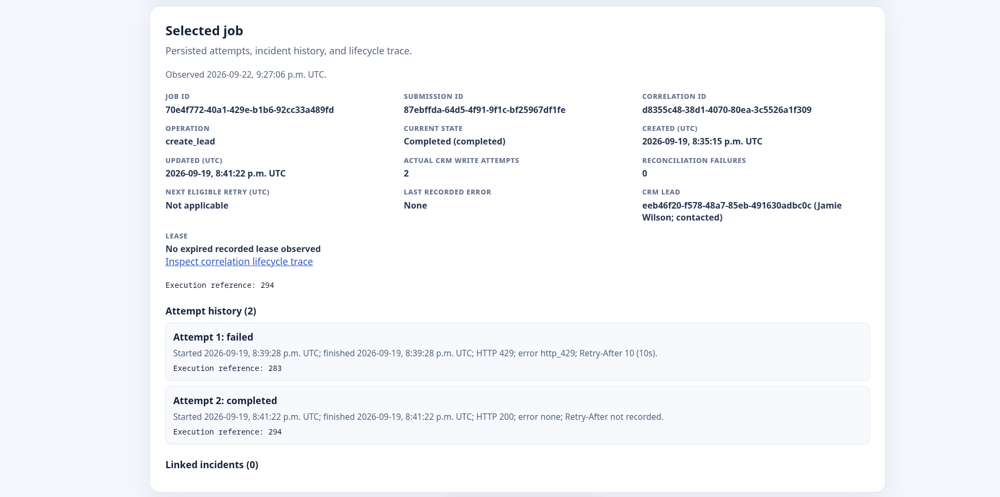

The ledger retains the failed attempt, `Retry-After`, and subsequent completion on the same job. It is historical evidence, not part of the newly recorded synthetic customer's successful first attempt. See the [complete recovery verification](phase-3-verification.md), [operational runbook](phase-3-runbook.md), and [repeatable 429/lost-ack demo](guided-demo.md).

## Verification and boundaries

| Recorded operation | Evidence | Result |
|---|---|---|
| Lead intake | n8n execution 63187 and persisted customer trace | Success; HTTP 201; AI enriched |
| Local booking / confirmation | n8n execution 63283 and local readback | Success; one saved appointment; development SMTP accepted |
| Live CRM | Contact/Opportunity readback and stage-sync state | Matching records; Appointment Booked; stage sync completed |
| Initial daily report | n8n execution 63339, Make run, Sheets readback | Success; one report row added |
| Daily report refresh | n8n execution 63370, Make run, Sheets readback | Success; same row updated; no duplicate report row |

Captured and verified **October 3, 2026**. The recording demonstrates a controlled synthetic journey through configured live accounts, not production traffic, uptime, universal exactly-once delivery, or customer ROI. Its manual report runs do not imply the Make scenario is continuously scheduled. Make and Sheets remain downstream: a reporting failure cannot undo accepted intake or booking.

The verification notes and frame manifest are committed alongside the assets.

## Reproduce the public screenshots

The recorded-journey frames and animated preview are reproducible from the committed MP4. The retained native GHL workflow and historical recovery screenshots are preserved separately and are not regenerated by this command.

```bash
node scripts/capture_portfolio.mjs   # requires ffmpeg; re-extract the full-HD frames
node scripts/capture_portfolio.mjs --preview  # regenerate the short README preview
node scripts/verify_portfolio.mjs    # check local links, image dimensions, timing, and video checksum
```

[Back to the project overview](../README.md)
